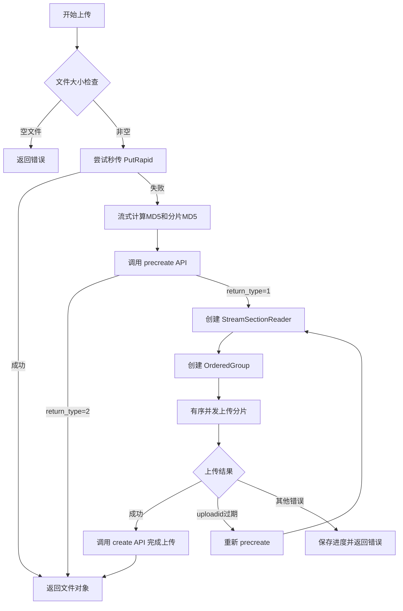
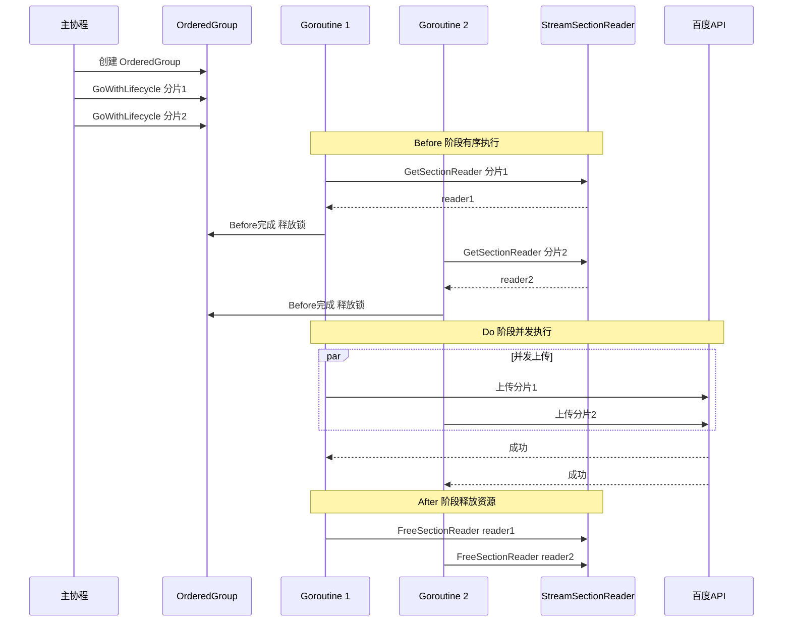

# 百度网盘流式上传重构方案

## 1. 背景与问题分析

### 1.1 当前实现问题

当前百度网盘上传实现位于 [`drivers/baidu_netdisk/driver.go`](drivers/baidu_netdisk/driver.go:191-393)，存在以下问题：

**问题代码（第202-217行）：**
```go
var (
    cache = stream.GetFile()
    tmpF  *os.File
    err   error
)
if cache == nil {
    tmpF, err = os.CreateTemp(conf.Conf.TempDir, "file-*")
    // ... 创建临时文件缓存整个上传文件
    cache = tmpF
}
```

**根本原因：**
- 第337行使用 `io.NewSectionReader(cache, offset, size)` 需要 `io.ReaderAt` 接口
- 为了支持并发上传分片，需要能够随机访问文件的任意位置
- 当前解决方案是将整个文件缓存到本地临时文件

**影响：**
- 需要本地存储空间 ≥ 最大上传文件大小
- 对于大文件上传，会占用大量磁盘空间
- 在存储空间有限的环境下无法上传大文件

### 1.2 成功案例分析

#### 123open 流式上传机制（[`drivers/123_open/upload.go`](drivers/123_open/upload.go:45-171)）

```go
// 核心实现
ss, err := stream.NewStreamSectionReader(file, int(chunkSize), &up)

threadG, uploadCtx := errgroup.NewOrderedGroupWithContext(ctx, thread, ...)

for partIndex := range uploadNums {
    threadG.GoWithLifecycle(errgroup.Lifecycle{
        Before: func(ctx context.Context) (err error) {
            reader, err = ss.GetSectionReader(offset, size)  // 获取分片Reader
            return
        },
        Do: func(ctx context.Context) (err error) {
            // 执行上传
            return nil
        },
        After: func(err error) {
            ss.FreeSectionReader(reader)  // 释放Reader
        },
    })
}
```

**关键特点：**
1. 使用 `NewStreamSectionReader` 实现流式读取
2. 使用 `NewOrderedGroupWithContext` 保证 Before 阶段有序执行
3. 三阶段生命周期：Before（获取Reader）→ Do（上传）→ After（释放Reader）
4. 流式表单构建：`io.MultiReader(head, reader, tail)`

#### 115open 流式上传机制（[`drivers/115_open/upload.go`](drivers/115_open/upload.go:72-149)）

```go
ss, err := streamPkg.NewStreamSectionReader(stream, int(chunkSize), &up)

for i := int64(1); i <= partNum; i++ {
    rd, err := ss.GetSectionReader(offset, partSize)
    err = retry.Do(func() error {
        rd.Seek(0, io.SeekStart)
        part, err := bucket.UploadPart(imur, driver.NewLimitedUploadStream(ctx, rd), partSize, int(i))
        // ...
    }, ...)
    ss.FreeSectionReader(rd)
}
```

**关键特点：**
1. 顺序上传分片（for循环 + retry.Do）
2. 每个分片上传完成后立即释放
3. 使用 OSS SDK 上传

### 1.3 StreamSectionReader 机制分析

[`internal/stream/util.go`](internal/stream/util.go:224-381) 中的 `StreamSectionReaderIF` 接口：

```go
type StreamSectionReaderIF interface {
    GetSectionReader(off, length int64) (io.ReadSeeker, error)  // 获取分片Reader
    FreeSectionReader(sr io.ReadSeeker)                         // 释放分片Reader
    DiscardSection(off int64, length int64) error               // 丢弃分片数据
}
```

**实现类型：**
1. `cachedSectionReader` - 当文件已缓存时使用，直接返回 SectionReader
2. `directSectionReader` - 流式读取，使用内存缓冲池

**directSectionReader 工作原理：**
- 维护 `fileOffset` 跟踪当前读取位置
- 使用 `bufPool` 缓冲池管理内存
- `GetSectionReader` 从流中读取指定长度数据到缓冲区
- `FreeSectionReader` 将缓冲区归还池中

**关键约束：**
- **线程不安全**：必须按顺序调用 `GetSectionReader`
- 请求的 offset 必须等于当前 fileOffset

## 2. 整体架构设计

### 2.1 架构对比

```
当前架构：
┌─────────────┐    ┌──────────────┐    ┌─────────────────┐
│ FileStream  │───>│ 临时文件缓存  │───>│ 并发分片上传     │
└─────────────┘    │ (整个文件)    │    │ (SectionReader) │
                   └──────────────┘    └─────────────────┘

重构后架构：
┌─────────────┐    ┌────────────────────┐    ┌─────────────────┐
│ FileStream  │───>│ StreamSectionReader │───>│ 有序并发分片上传  │
└─────────────┘    │ (按需缓存分片)       │    │ (OrderedGroup)  │
                   └────────────────────┘    └─────────────────┘
```

### 2.2 新架构流程图



### 2.3 分片上传详细流程



## 3. 关键技术点设计

### 3.1 MD5计算策略

**当前实现问题（第230-258行）：**
- 需要遍历整个文件计算 MD5
- 同时计算 fileMd5、sliceMd5、blockList
- 如果没有缓存文件，需要边读边写临时文件

**重构方案：**

使用 [`stream.StreamHashFile()`](internal/stream/util.go:182-222) 进行流式哈希计算：

```go
// 伪代码
func calculateHashes(ctx context.Context, stream model.FileStreamer, sliceSize int64) (contentMd5, sliceMd5 string, blockList []string, err error) {
    size := stream.GetSize()
    count := (size + sliceSize - 1) / sliceSize
    
    // 创建 StreamSectionReader 用于流式读取
    ss, err := stream.NewStreamSectionReader(stream, int(sliceSize), nil)
    if err != nil {
        return "", "", nil, err
    }
    
    fileMd5H := md5.New()
    sliceMd5H := md5.New()  // 前256KB
    blockList = make([]string, 0, count)
    
    const SliceSize = 256 * 1024
    sliceWritten := int64(0)
    
    for i := 0; i < count; i++ {
        offset := int64(i) * sliceSize
        length := min(sliceSize, size-offset)
        
        reader, err := ss.GetSectionReader(offset, length)
        if err != nil {
            return "", "", nil, err
        }
        
        // 计算分片MD5
        sliceMd5Calc := md5.New()
        
        // 同时写入多个哈希计算器
        writers := []io.Writer{fileMd5H, sliceMd5Calc}
        if sliceWritten < SliceSize {
            writers = append(writers, utils.LimitWriter(sliceMd5H, SliceSize-sliceWritten))
        }
        
        reader.Seek(0, io.SeekStart)
        n, err := io.Copy(io.MultiWriter(writers...), reader)
        if err != nil {
            ss.FreeSectionReader(reader)
            return "", "", nil, err
        }
        sliceWritten += n
        
        blockList = append(blockList, hex.EncodeToString(sliceMd5Calc.Sum(nil)))
        ss.FreeSectionReader(reader)
    }
    
    return hex.EncodeToString(fileMd5H.Sum(nil)), 
           hex.EncodeToString(sliceMd5H.Sum(nil)), 
           blockList, nil
}
```

**关键改进：**
1. 使用 StreamSectionReader 按分片读取
2. 每个分片读取后立即释放内存
3. 同时计算所有需要的哈希值
4. 不需要创建临时文件

### 3.2 分片上传逻辑

**当前实现（第316-347行）：**
```go
for i, partseq := range precreateResp.BlockList {
    threadG.Go(func(ctx context.Context) error {
        section := io.NewSectionReader(cache, offset, size)  // 需要 ReaderAt
        err := d.uploadSlice(ctx, ...)
        return err
    })
}
```

**重构方案：**

```go
// 伪代码
func (d *BaiduNetdisk) uploadChunks(ctx context.Context, stream model.FileStreamer, 
    precreateResp *PrecreateResp, sliceSize int64, up driver.UpdateProgress) error {
    
    size := stream.GetSize()
    count := int((size + sliceSize - 1) / sliceSize)
    
    // 创建 StreamSectionReader
    ss, err := stream.NewStreamSectionReader(stream, int(sliceSize), &up)
    if err != nil {
        return err
    }
    
    // 使用 OrderedGroup 保证 Before 阶段有序
    thread := min(d.uploadThread, len(precreateResp.BlockList))
    threadG, upCtx := errgroup.NewOrderedGroupWithContext(ctx, thread,
        retry.Attempts(UPLOAD_RETRY_COUNT),
        retry.Delay(UPLOAD_RETRY_WAIT_TIME),
        retry.MaxDelay(UPLOAD_RETRY_MAX_WAIT_TIME),
        retry.DelayType(retry.BackOffDelay),
        retry.RetryIf(func(err error) bool {
            return !errors.Is(err, ErrUploadIDExpired)
        }),
        retry.LastErrorOnly(true))
    
    totalParts := len(precreateResp.BlockList)
    
    for i, partseq := range precreateResp.BlockList {
        if utils.IsCanceled(upCtx) {
            break
        }
        if partseq < 0 {
            continue
        }
        
        i, partseq := i, partseq
        offset := int64(partseq) * sliceSize
        length := min(sliceSize, size-offset)
        
        var reader io.ReadSeeker
        
        threadG.GoWithLifecycle(errgroup.Lifecycle{
            Before: func(ctx context.Context) error {
                var err error
                reader, err = ss.GetSectionReader(offset, length)
                return err
            },
            Do: func(ctx context.Context) error {
                reader.Seek(0, io.SeekStart)
                err := d.uploadSliceStream(ctx, precreateResp.UploadURL, 
                    precreateResp.Uploadid, partseq, stream.GetName(), reader, length)
                if err != nil {
                    return err
                }
                precreateResp.BlockList[i] = -1
                progress := float64(threadG.Success()+1) * 100 / float64(totalParts+1)
                up(progress)
                return nil
            },
            After: func(err error) {
                ss.FreeSectionReader(reader)
            },
        })
    }
    
    return threadG.Wait()
}
```

### 3.3 表单构建方式

**当前实现（第430-456行）：**
```go
func (d *BaiduNetdisk) uploadSlice(ctx context.Context, uploadUrl string, 
    params map[string]string, fileName string, file *io.SectionReader) error {
    
    b := bytes.NewBuffer(make([]byte, 0, bytes.MinRead))
    mw := multipart.NewWriter(b)
    _, err := mw.CreateFormFile("file", fileName)
    // ...
    head := bytes.NewReader(b.Bytes()[:headSize])
    tail := bytes.NewReader(b.Bytes()[headSize:])
    rateLimitedRd := driver.NewLimitedUploadStream(ctx, io.MultiReader(head, file, tail))
    // ...
}
```

**重构方案：**

修改 `uploadSlice` 函数签名，接受 `io.ReadSeeker` 而不是 `*io.SectionReader`：

```go
// 伪代码
func (d *BaiduNetdisk) uploadSliceStream(ctx context.Context, uploadUrl string,
    uploadid string, partseq int, fileName string, reader io.ReadSeeker, size int64) error {
    
    params := map[string]string{
        "method":       "upload",
        "access_token": d.AccessToken,
        "type":         "tmpfile",
        "path":         path,
        "uploadid":     uploadid,
        "partseq":      strconv.Itoa(partseq),
    }
    
    // 构建 multipart 表单
    b := bytes.NewBuffer(make([]byte, 0, bytes.MinRead))
    mw := multipart.NewWriter(b)
    _, err := mw.CreateFormFile("file", fileName)
    if err != nil {
        return err
    }
    headSize := b.Len()
    err = mw.Close()
    if err != nil {
        return err
    }
    
    head := bytes.NewReader(b.Bytes()[:headSize])
    tail := bytes.NewReader(b.Bytes()[headSize:])
    
    // 使用 io.ReadSeeker 而不是 *io.SectionReader
    rateLimitedRd := driver.NewLimitedUploadStream(ctx, io.MultiReader(head, reader, tail))
    
    req, err := http.NewRequestWithContext(ctx, http.MethodPost, 
        uploadUrl+"/rest/2.0/pcs/superfile2", rateLimitedRd)
    if err != nil {
        return err
    }
    
    // 设置请求参数和头
    query := req.URL.Query()
    for k, v := range params {
        query.Set(k, v)
    }
    req.URL.RawQuery = query.Encode()
    req.Header.Set("Content-Type", mw.FormDataContentType())
    req.ContentLength = int64(b.Len()) + size
    
    // 发送请求...
}
```

### 3.4 uploadid过期重试

**当前实现（第361-375行）：**
```go
if errors.Is(err, ErrUploadIDExpired) {
    log.Warn("[baidu_netdisk] uploadid expired, will restart from scratch")
    newPre, err2 := d.precreate(ctx, path, streamSize, blockListStr, "", "", ctime, mtime)
    // ...
    precreateResp = newPre
    precreateResp.UploadURL = ""
    base.SaveUploadProgress(d, precreateResp, d.AccessToken, contentMd5)
    continue uploadLoop
}
```

**重构方案：**

由于流式上传无法回退重读，uploadid 过期时需要特殊处理：

```go
// 伪代码
uploadLoop:
for range 2 {
    // 重新创建 StreamSectionReader（如果是重试）
    if ss == nil {
        // 第一次或重试时需要重新获取流
        // 这里需要依赖上层提供可重新获取的流
        ss, err = stream.NewStreamSectionReader(stream, int(sliceSize), &up)
        if err != nil {
            return nil, err
        }
    }
    
    err = d.uploadChunks(ctx, ss, precreateResp, sliceSize, up)
    
    if err == nil {
        break uploadLoop
    }
    
    if errors.Is(err, ErrUploadIDExpired) {
        log.Warn("[baidu_netdisk] uploadid expired, will restart from scratch")
        
        // 重新 precreate
        newPre, err2 := d.precreate(ctx, path, streamSize, blockListStr, "", "", ctime, mtime)
        if err2 != nil {
            return nil, err2
        }
        if newPre.ReturnType == 2 {
            return fileToObj(newPre.File), nil
        }
        precreateResp = newPre
        precreateResp.UploadURL = ""
        
        // 需要重新获取流 - 这是流式上传的限制
        // 如果流不支持重新读取，则无法重试
        ss = nil  // 标记需要重新创建
        
        base.SaveUploadProgress(d, precreateResp, d.AccessToken, contentMd5)
        continue uploadLoop
    }
    
    return nil, err
}
```

**重要说明：**
- 流式上传的一个限制是无法回退重读
- 如果 uploadid 过期，需要重新获取流
- 对于 SeekableStream，可以通过 RangeRead 重新获取
- 对于纯流式输入，可能无法支持 uploadid 过期重试

## 4. 代码改造范围

### 4.1 需要修改的函数

| 函数 | 文件位置 | 修改内容 |
|------|----------|----------|
| `Put` | driver.go:191-393 | 主要重构目标，移除临时文件缓存 |
| `uploadSlice` | driver.go:430-490 | 修改参数类型，支持 io.ReadSeeker |

### 4.2 需要新增的辅助函数

```go
// 1. 流式计算哈希值
func (d *BaiduNetdisk) calculateHashesStream(ctx context.Context, stream model.FileStreamer, 
    sliceSize int64) (contentMd5, sliceMd5 string, blockList []string, err error)

// 2. 流式分片上传
func (d *BaiduNetdisk) uploadChunksStream(ctx context.Context, stream model.FileStreamer,
    precreateResp *PrecreateResp, sliceSize int64, path string, 
    up driver.UpdateProgress) error

// 3. 修改后的分片上传（接受 io.ReadSeeker）
func (d *BaiduNetdisk) uploadSliceStream(ctx context.Context, uploadUrl string,
    uploadid string, partseq int, path string, fileName string, 
    reader io.ReadSeeker, size int64) error
```

### 4.3 需要删除的代码段

| 代码行 | 内容 | 原因 |
|--------|------|------|
| 202-217 | 临时文件创建逻辑 | 不再需要缓存整个文件 |
| 230-258 | 同步MD5计算循环 | 改用流式计算 |
| 259-267 | 临时文件seek和错误处理 | 不再使用临时文件 |

### 4.4 对现有API调用的影响

| API | 影响 | 说明 |
|-----|------|------|
| `precreate` | 无变化 | 参数不变 |
| `uploadSlice` | 参数变化 | file 参数从 `*io.SectionReader` 改为 `io.ReadSeeker` |
| `create` | 无变化 | 参数不变 |
| `getUploadUrl` | 无变化 | 参数不变 |

## 5. 兼容性考虑

### 5.1 断点续传功能

**保留方式：**
- 继续使用 `base.SaveUploadProgress` 和 `base.GetUploadProgress`
- 保存 `PrecreateResp` 包含 `BlockList`（未完成的分片列表）
- 恢复时跳过已完成的分片

**限制：**
- 流式上传无法跳过已完成的分片（流不能回退）
- 断点续传仅在有缓存文件时有效
- 对于纯流式输入，断点续传功能受限

**解决方案：**
```go
// 检查是否支持断点续传
func canResumeUpload(stream model.FileStreamer, precreateResp *PrecreateResp) bool {
    // 如果有缓存文件，可以断点续传
    if stream.GetFile() != nil {
        return true
    }
    // 如果所有分片都需要上传，可以从头开始
    if len(precreateResp.BlockList) == totalParts {
        return true
    }
    // 否则无法断点续传
    return false
}
```

### 5.2 并发上传功能

**保留方式：**
- 使用 `errgroup.NewOrderedGroupWithContext` 替代 `errgroup.NewGroupWithContext`
- Before 阶段有序执行，保证流式读取顺序
- Do 阶段并发执行，保持上传并发性

**关键点：**
- OrderedGroup 的 Before 阶段是串行的
- Do 阶段是并发的
- 这样既保证了流式读取的顺序性，又保持了上传的并发性

### 5.3 小文件处理（< 4MB）

**当前行为：**
- 小文件也走分片上传流程
- 只有一个分片

**重构后行为：**
- 保持不变
- 小文件同样使用 StreamSectionReader
- 只创建一个分片的缓冲区

### 5.4 秒传（PutRapid）

**当前实现：**
```go
if newObj, err := d.PutRapid(ctx, dstDir, stream); err == nil {
    return newObj, nil
}
```

**重构后：**
- 保持不变
- 秒传在流式上传之前尝试
- 如果秒传成功，不需要实际上传数据

## 6. 实现步骤

### 6.1 阶段一：准备工作

1. **创建新的上传函数文件**
   - 创建 `drivers/baidu_netdisk/upload.go`
   - 将上传相关函数移到新文件

2. **添加流式哈希计算函数**
   - 实现 `calculateHashesStream` 函数
   - 使用 StreamSectionReader 按分片计算

### 6.2 阶段二：核心重构

3. **修改 uploadSlice 函数**
   - 创建新函数 `uploadSliceStream`
   - 接受 `io.ReadSeeker` 参数
   - 保留原函数用于兼容

4. **实现流式分片上传**
   - 创建 `uploadChunksStream` 函数
   - 使用 OrderedGroup 实现有序并发
   - 实现三阶段生命周期

5. **重构 Put 函数**
   - 移除临时文件创建逻辑
   - 使用流式哈希计算
   - 调用流式分片上传

### 6.3 阶段三：完善与测试

6. **处理断点续传**
   - 检测是否支持断点续传
   - 对于不支持的情况给出警告

7. **处理 uploadid 过期**
   - 实现重试逻辑
   - 处理流不可重读的情况

8. **清理旧代码**
   - 删除不再需要的临时文件逻辑
   - 删除旧的 uploadSlice 函数（如果不再需要）

### 6.4 验证方法

| 步骤 | 验证方法 |
|------|----------|
| 流式哈希计算 | 对比新旧函数计算结果是否一致 |
| 分片上传 | 上传测试文件，验证文件完整性 |
| 并发上传 | 使用多线程配置，验证上传速度 |
| 断点续传 | 中断上传后恢复，验证续传功能 |
| uploadid过期 | 模拟过期场景，验证重试逻辑 |
| 小文件 | 上传小于4MB的文件 |
| 大文件 | 上传超过100MB的文件 |

### 6.5 潜在风险和应对方案

| 风险 | 影响 | 应对方案 |
|------|------|----------|
| 流不可重读 | uploadid过期时无法重试 | 检测流类型，对于SeekableStream支持重试 |
| 内存占用 | 并发上传时多个分片同时在内存 | 限制并发数，使用缓冲池 |
| 哈希计算错误 | 上传失败或数据损坏 | 充分测试，对比旧实现结果 |
| 断点续传失效 | 用户体验下降 | 对于有缓存文件的情况保持支持 |

## 7. 测试验证方案

### 7.1 单元测试

```go
// 测试流式哈希计算
func TestCalculateHashesStream(t *testing.T) {
    // 创建测试文件流
    // 对比新旧函数计算结果
}

// 测试分片上传
func TestUploadChunksStream(t *testing.T) {
    // Mock 百度API
    // 验证分片顺序和内容
}
```

### 7.2 集成测试

1. **小文件上传测试**（< 4MB）
   - 验证单分片上传
   - 验证文件完整性

2. **大文件上传测试**（> 100MB）
   - 验证多分片上传
   - 验证并发上传
   - 验证内存占用

3. **断点续传测试**
   - 中断上传
   - 恢复上传
   - 验证续传正确性

4. **错误处理测试**
   - 网络错误重试
   - uploadid过期重试
   - 取消上传

### 7.3 性能测试

1. **内存占用对比**
   - 旧实现：临时文件大小 = 文件大小
   - 新实现：内存占用 ≈ 分片大小 × 并发数

2. **上传速度对比**
   - 测试不同文件大小的上传速度
   - 测试不同并发数的影响

## 8. 改造前后对比

### 8.1 代码结构对比

| 方面 | 改造前 | 改造后 |
|------|--------|--------|
| 临时文件 | 需要创建整个文件大小的临时文件 | 不需要临时文件 |
| 内存占用 | 低（数据在磁盘） | 中等（分片大小 × 并发数） |
| 磁盘占用 | 高（= 文件大小） | 无 |
| 并发模型 | errgroup.NewGroupWithContext | errgroup.NewOrderedGroupWithContext |
| 分片读取 | io.NewSectionReader | StreamSectionReader |
| MD5计算 | 同步遍历整个文件 | 流式按分片计算 |

### 8.2 API调用流程对比

**改造前：**
```
1. 创建临时文件
2. 读取流 → 写入临时文件（同时计算MD5）
3. precreate API
4. 并发上传分片（从临时文件随机读取）
5. create API
6. 删除临时文件
```

**改造后：**
```
1. 创建 StreamSectionReader
2. 流式计算MD5（按分片读取）
3. precreate API
4. 有序并发上传分片（Before有序，Do并发）
5. create API
6. 释放 StreamSectionReader
```

### 8.3 资源使用对比

| 资源 | 改造前 | 改造后 |
|------|--------|--------|
| 磁盘空间 | O(n) - 文件大小 | O(1) - 无 |
| 内存 | O(1) - 固定缓冲区 | O(k) - k为并发数×分片大小 |
| 文件句柄 | 1个临时文件 | 0个 |

## 9. 总结

### 9.1 设计要点

1. **使用 StreamSectionReader 替代临时文件**
   - 按需读取分片数据
   - 使用内存缓冲池管理内存
   - 读取后立即释放

2. **使用 OrderedGroup 实现有序并发**
   - Before 阶段有序执行，保证流式读取顺序
   - Do 阶段并发执行，保持上传并发性
   - After 阶段释放资源

3. **流式计算MD5**
   - 按分片读取数据
   - 同时计算多个哈希值
   - 不需要缓存整个文件

4. **保持兼容性**
   - 保留断点续传功能（有限制）
   - 保留并发上传功能
   - 保留秒传功能

### 9.2 实现优先级

1. **高优先级**
   - 流式分片上传（核心功能）
   - 流式MD5计算
   - OrderedGroup 并发控制

2. **中优先级**
   - uploadid 过期重试
   - 断点续传支持

3. **低优先级**
   - 性能优化
   - 错误处理完善

### 9.3 预期收益

1. **消除磁盘空间限制**
   - 不再需要本地存储空间 ≥ 最大上传文件大小
   - 支持在存储空间有限的环境下上传大文件

2. **减少I/O操作**
   - 不需要先写入临时文件再读取
   - 数据直接从源流传输到网络

3. **提高资源利用效率**
   - 内存按需分配
   - 使用缓冲池复用内存